# 🚀 Flask Application Deployment on AWS EKS using Docker & ECR

## 📌 Objective
Deploy a Python Flask application on AWS EKS using Kubernetes Deployments and Services, enabling external access via LoadBalancer while managing containerized workloads in a scalable cloud environment.

---

## 🏗️ Architecture Diagram

```mermaid
flowchart LR

    A[👩‍💻 User Browser] --> B[🌐 AWS LoadBalancer Service]
    B --> C[☸️ Kubernetes Service]
    C --> D[📦 Kubernetes Deployment]
    D --> E[🐳 Docker Container - Flask App]

    F[(📦 Amazon ECR Repository)] --> D

    subgraph AWS Cloud
        B
        C
        D
        E
        F
    end

    subgraph EKS Cluster
        C
        D
        E
    end
```



---

## 🛠️ Technologies Used
- Python (Flask)
- Docker
- AWS EC2
- AWS IAM
- Amazon ECR
- Amazon EKS
- Kubernetes (Deployment & Service)
- AWS CLI
- kubectl

---

## 🏗️ Project Architecture Flow
1. Flask application created on EC2  
2. Docker image built from Flask app  
3. Docker image pushed to Amazon ECR  
4. Kubernetes Deployment pulls image from ECR  
5. Kubernetes Service exposes application externally  

---

## 🔐 Security Group Configuration

| Port | Reason |
|------|--------|
| 22 | SSH |
| 5000 | Flask Application |
| 80 | HTTP |
| 30000–32767 | Kubernetes NodePort |

---

## ⚙️ Step-by-Step Implementation

---

### Step 1️⃣ Create EC2 Instance
- Name: **DevOps-Server**
- Install Python, Docker, AWS CLI, kubectl

---

### Step 2️⃣ Create Flask Application

```bash
sudo apt update
sudo apt install python3 python3-pip -y

mkdir flask-app
cd flask-app

python3 -m venv venv
source venv/bin/activate

pip install flask
python app.py
```

Access application:
```
http://<EC2_PUBLIC_IP>:5000
```

---

### Step 3️⃣ Docker Image Creation

```bash
sudo apt install docker.io -y
sudo systemctl start docker
sudo usermod -aG docker ubuntu
newgrp docker

docker build -t flask-k8s-app .
docker run -d -p 5000:5000 flask-k8s-app
```

---

### Step 4️⃣ Create IAM User
- User Name: **DevOps-User**
- Permissions: AmazonECRFullAccess, AmazonEKSFullAccess

---

### Step 5️⃣ Push Docker Image to Amazon ECR

```bash
aws configure

aws ecr get-login-password --region ap-south-1 \
| docker login --username AWS --password-stdin <ECR_URL>

docker tag flask-k8s-app:latest <ECR_URL>:latest
docker push <ECR_URL>:latest
```

---

### Step 6️⃣ Create EKS Cluster
- Cluster Name: **flask-k8s-cluster**
- Kubernetes Version: **1.34**
- Node Type: **t3.medium**
- Desired Nodes: **2**

---

### Step 7️⃣ Connect to EKS Cluster

```bash
aws eks update-kubeconfig --region ap-south-1 --name flask-k8s-cluster
kubectl get nodes
```

---

### Step 8️⃣ Kubernetes Deployment & Service

```bash
kubectl apply -f kubernetes/deployment.yaml
kubectl apply -f kubernetes/service.yaml
```

Check status:

```bash
kubectl get pods
kubectl get svc
```

---

## 🌐 Access Application

```bash
kubectl get svc flask-service
```

Open browser:
```
http://<EXTERNAL-IP>
```

---

## ✅ Result

✔ Flask application successfully deployed on AWS EKS  
✔ Docker image pulled from Amazon ECR  
✔ Application accessible externally via Kubernetes Service  

---

## 📁 Project Structure

```
flask-k8s-ecr-eks/
│
├── app.py
├── Dockerfile
├── requirements.txt
│
├── kubernetes/
│   ├── deployment.yaml
│   └── service.yaml
```

---

## 👩‍💻 Author
**Sejal S. Pawar**

---

## ⭐ Conclusion
This project demonstrates real-world DevOps skills including containerization, Kubernetes orchestration, and AWS cloud deployment using best practices.
